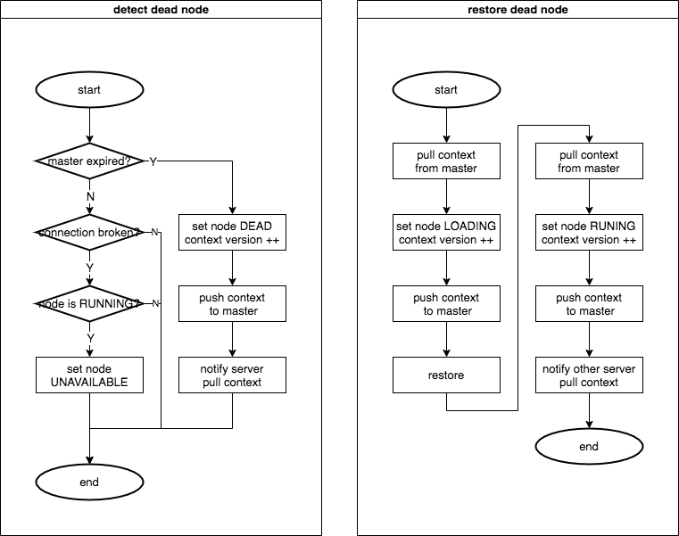

# Availability

## Context

TableDescriptor 的 context 部分包含了 node 状态，分片信息等应保持全局一致的 meta 信息，context 中还维护了 version，每当改变 context 时，都要同时更新 version。在发送 request 时，会附带当前的 version，server 会检查两边的 version 是否一致，这就保证了一次操作涉及的所有节点都基于一致的 context 完成。 

master 上会维护最新的 context，在修改本地的 context 后，需要 push context to master。一般的 context 修改流程如上图，通过乐观锁或悲观锁保证 context 修改满足事务要求。

## Operator

大部分的 Operator（包括 UDFOperator）的处理流程如上图，最终会返回一个 Status。目前 Status 包括 Ok, ServerContextTooNew, ServerContextTooOld, OOM（包括内存不够和 storage 正在 update context 两种情况）, TimeOut（包括超时和连接异常两种情况），NoReplica （所有副本所在节点都不可用），整个流程由 Handler, Operator, Server 共同完成。当节点的 context 不一致时，最终都会自动同步到最新的 context。

## Restore

如上图，storage 中 Node Status 包括 RUNNING, DEAD, LOADING, UNAVAILABALE。只有 RUNNING node 才能响应 Handler 的请求，LOADING 表示此节点正在 restore 这个 storage （不是 load ）。 DEAD 表示此节点在 master 上的信息已经 expired，此时认为这个此节点已经挂掉，可以重启并 restore 数据，重启后会分配一个新的 node id。 UNAVAILABALE 表示这个 client 和 server 的 rpc 连接已经失效，但是此时还不能重启。

DEAD node 检测是在 Handler 中自动进行，重启需要用户以 restore 模式启动一个新的 server，之后 server 会自动找到一个 DEAD node，并依次 restore 与它相关的所有 storage，restore 一个 storage 的流程如上图。

只要每个 shard 都至少有一个 RUNNING node，就保证了 PullHandler 是可用的。
