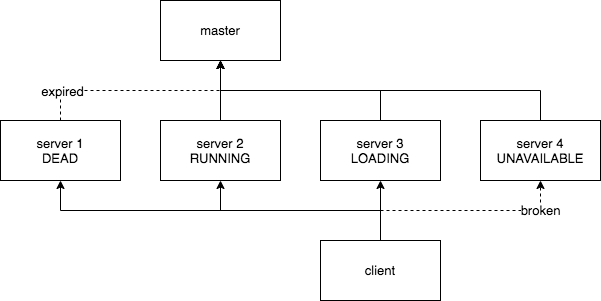

# Availability

## Operator

TableDescriptor 的 context 部分包含了 node 状态，分片信息等应保持全局一致的 meta 信息，context 中还维护了 version 。每当一个 client 或 server 想要改变 context 时，都要更新 version，并 push context to master。 在发送 request 时，会附带当前的 version ，server 会检查两边的 version 是否一致，这就保证了 Operator 都基于一致的 context 完成。 当 version 不一致时，相关联的 client 和 server 会同步到最新的 context ，而当 version 一致时，即使 context 不是最新的，也保证了 data 部分的兼容性。

大部分的 Operator（包括 UDFOperator）的处理流程如上图，最终会返回一个 Status 。目前 Status 包括 Ok, ServerContextTooNew, ServerContextTooOld, OOM（包括内存不够和 storage 正在 update context 两种情况）, TimeOut（包括超时和连接异常两种情况），NoReplica （所有副本所在节点都不可用），整个流程由 Handler, Operator, Server 共同完成。SyncOperator 和 UpdateContextOperator 不支持重试，而且它们处理流程也与一般的 Operator 不同。

## Restore

如上图，storage 中 Node Status 包括 RUNNING, DEAD, LOADING, UNAVAILABALE 。只有 RUNNING node 才能响应 Handler 的请求，LOADING 表示此节点正在 restore 这个 storage （不是 load ）。 DEAD 表示此节点在 master 上的信息已经 expired ，此时认为这个此节点已经挂掉，可以重启并 restore 数据，重启后会分配一个新的 node id。 UNAVAILABALE 表示这个 client 和 server 的 rpc 连接已经失效，但是此时还不能重启。

DEAD node 检测是在 Handler 中自动进行，重启需要用户以 restore 模式启动一个新的 server，之后 server 会自动找到一个 DEAD node，并依次 restore 与它相关的所有 storage ，restore 一个 storage 的流程如上图。

只要每个 shard 都至少有一个 RUNNING 的 node，就保证了 PullHandler 是可用的。

