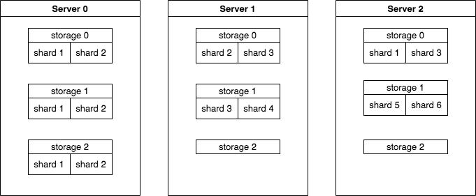

# Overview

以下介绍每个代码目录的主要内容和相关概念。

## Common

common中包含以下内容
* 常用数据结构
* 消息的定义 PSRequest 和 PSResponse
* rpc 调用通用流程 DistributedAsyncReturn

## Storage

如上图所示，storage 表示一个抽象的存储空间，可以有多个 storage，每个 storage 会分为多个 shard，存储在不同的 server 上。图中 storage 0 是双 副本， storage 1 是单副本， storage 2 仅有两个 shard，都在 server 0 上。预估服务通常使用多副本，训练不支持多副本。

## Service

各结构关系如上图所示，TableDescriptor 包括 context 和 data 两部分，这个 context 不是 Context 类，主要指某个 storage 的元数据，例如 operator configure 和分片信息。context 会 push 到 master 上，并通过 master 同步给所有使用这个 storage 的 server 和 client。 master 上会存储当前所有 storage 的 context 信息。 

## Operator

用户可以通过实现自定义的 Operator 并注册来定制自己的 Parameter Server。

* Operator
* StorageOperator
* PushOperator
* PullOperator
* ForEachOperator
* EraseIfOperator
* DumpOperator
* LoadOperator
* UDFOperator
* RestoreOperator
* UpdateContextOperator
* SyncOperator

## Handler

每个 Operator 都有对应的 Handler，这些 Operator 一般定义了 client 如何发送 request, server 如何处理 request 并回复 response，以及 client 如何处理 response。用户可以通过 Handler 来操作 PS。 Handler 中封装了部分异常处理并支持自动重试。

上图是从创建 storage，到使用 Handler 对 storage 进行操作的一般流程， operator configure 存储在 TableDescriptor 的 context 部分中，所有的 server 和 client 都会基于使用相同的 operator configure 创建 Operator，以此保证 request 和 response 的处理流程能够正确对接。

## NativePS

NativePS 假设 client 端已经足够装下整个模型，可以提供单节点的预估服务。使用 NativePullHandler 可以在一个线程中完成 client 端和 server 端的所有操作，避免了线程切换，但是仍然存在消息序列化的 overhead。

## Controller & Model

controller 和 model 部分主要和 server 的运维有关。