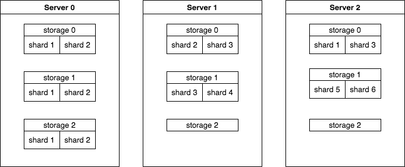
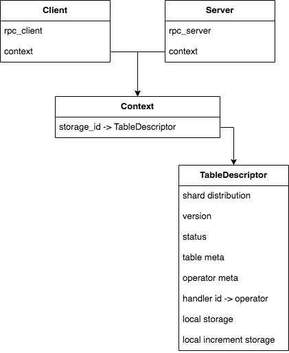
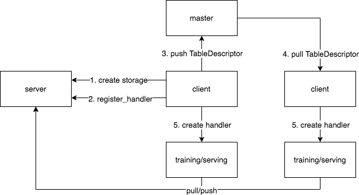

# overview

## common

common中包含以下内容
* 常用数据结构
* ps消息的定义PSRequest和PSResponse
* rpc调用通用流程DistributedAsyncReturn

## storage

如上图所示，一个storage表示一个抽象的存储空间，可以有多个storage，每个storage会分为多个shard，存储在不同的server上。图中storage 0是双副本，storage 1是单副本，storage2仅有两个shard，都在server 0上。预估服务通常使用多副本，训练不支持多副本。

## service

各结构关系如上图所示，TableDescriptor包括meta和storage两部分，其中meta会注册到master上，并通过master同步给所有使用这个storage的server和client，而storage data只存在于存储这个storage的server中。master上具有所有TableDescriptor meta数据，且与storage是一一对应的。

## operator

Operator中定义了client如何发送reqeust，server如何处理request并回复response，以及client如何处理response。

* StorageOperator 创建storage，指定RestoreOperator
* PullOperator 
* PushOperator 包括push梯度和update参数
* LoadOperator 
* DumpOperator
* RestoreOperator 节点挂掉后重启节点如何恢复数据
* ForEachOperator
* UpdateContextOperator 更新shard分布，shuffle数据
* SyncOperator 向另一个rpc空间中的ps同步增量数据
* UDFOperator 用户可以自定义以上Operator不能实现的操作

## handler

每个Operator都有对应的handler，用户可以通过handler来操作PS。handler中封装了对超时，Context不一致等异常处理并支持自动重试。

上图是从创建storage，到使用handler对storage进行pull/push操作的一般流程。

## native_ps

native_ps假设client端已经足够装下整个模型，可以提供单节点的预估服务。使用NativePullHandler可以在一个线程中完成client端和server端的所有操作，避免了线程切换，但是仍然存在消息序列化的overhead。

## controller & model

controller和model部分主要和server的运维有关。